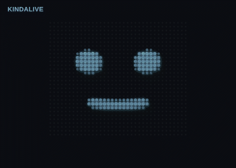
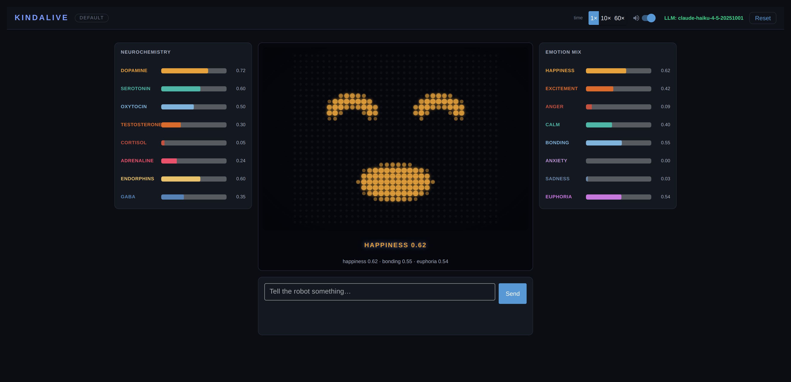

# Kindalive

Robot emotions through simulated neurochemistry — shown on an LED dot-matrix face.



Kindalive models robot emotions as **emergent states from simulated
body chemistry**, not as discrete labels. There is no `mood = "happy"`
variable. A robot maintains concentrations of 8 simulated
neurochemicals (dopamine, cortisol, oxytocin, …), and emotions are
read-only projections derived from that chemical state.

You type a paragraph — "you won the lottery", "the cat is missing and
a storm is rolling in" — an LLM (cloud Claude or any local
OpenAI-compatible model — incl. OpenRouter) translates it into chemical impulses, the
neurochemical engine integrates them, and a **retro LED dot-matrix
robot face** contorts to show the resulting
emotional mix, with every chemical level visible beside it.

## How It Works

```
   Your paragraph
        │
        ▼
  LLM Interpreter ──→ ChemicalImpulse[]
  (Claude or local)         │
                            ▼
                  Neurochemical Engine
                  (decay, interactions, sub-stepping)
                            │
              ┌─────────────┴─────────────┐
              ▼                           ▼
      Emotion Projection          Face Projection
      (8 emotions)                (12 FACS muscles)
              │                           │
              ▼                           ▼
        emotion bars              LED dot-matrix face
```

## Key Concepts

**8 Chemicals**: Dopamine, serotonin, oxytocin, testosterone, cortisol,
adrenaline, endorphins, GABA. Each has its own half-life, baseline, and
cross-chemical interactions. Adrenaline fades in minutes (fleeting
excitement). Serotonin moves over hours (lasting mood).

**8 Emotions**: Happiness, excitement, anger, calm, bonding, anxiety,
sadness, euphoria. Each is a weighted linear combination of chemical
levels — computed on the fly, never stored.

**12 Facial Muscles**: A second projection from the same chemistry,
named after FACS Action Units (brow raise, lid tighten, lip corner
pull, jaw open, …). They drive the LED face directly — no quantizing
through emotion labels.

**Seed Chemistry**: Every robot has a configurable baseline — its
"nature". A cheerful robot has higher resting serotonin and dopamine; a
stoic robot has elevated GABA and dampened interactions.

**LLM Interpreter**: Instead of hand-coding emotional mappings, an LLM
reads your paragraph and produces chemical impulses. "I won the
lottery" and "I won a free coffee" get very different responses —
automatically.

## Quick Start

```bash
# Everything: web dashboard + both LLM backends
pip3 install -e ".[all]"

# Offline — face + chemistry work, text input disabled
python3 -m kindalive.expression.web_ui

# With Claude (cloud)
ANTHROPIC_API_KEY=sk-ant-... python3 -m kindalive.expression.web_ui

# With a local model via Ollama / LM Studio / vLLM
KINDALIVE_LLM_BASE_URL=http://localhost:11434/v1 \
KINDALIVE_LLM_MODEL=llama3.1 \
python3 -m kindalive.expression.web_ui
```

The **core library is pure Python with zero dependencies** — `pip
install kindalive` alone gives you the neurochemical engine, the
emotion projection, the face projection, and the `Robot` API, ready to
embed in your own robot. Extras add the optional layers:

| Extra | What it adds |
|-------|--------------|
| `[web]` | The NiceGUI dashboard (LED face, chemical levels, emotion mix) |
| `[anthropic]` | Claude backend for the LLM interpreter |
| `[openai]` | Any OpenAI-compatible backend (Ollama, LM Studio, vLLM, OpenRouter) |
| `[all]` | All of the above |
| `[dev]` | pytest, hypothesis, coverage, mypy |

Open <http://localhost:8080>, type something to the robot, and watch
the face react. The UI auto-loads a `.env` file from the repo root, so
you can keep `ANTHROPIC_API_KEY=...` there instead of exporting it.



### On your phone

The dashboard is responsive and installable (Add to Home Screen launches
it fullscreen). Reach it from your phone on the same Wi-Fi:

```bash
python3 -m kindalive.expression.web_ui --host 0.0.0.0
# then open http://<your-computer-LAN-IP>:8080 on the phone
```

To use it without your computer running, host the included `Dockerfile`
on something always-on (a cloud VM, Fly.io/Render/Railway, or a
Raspberry Pi):

```bash
docker build -t kindalive .
docker run -p 8080:8080 -e ANTHROPIC_API_KEY=sk-ant-... kindalive
```

See [docs/web-ui.md](docs/web-ui.md#use-it-from-your-phone) for the full
walkthrough.

There is also a one-shot CLI:

```bash
python3 -m kindalive.main --text "Friday, finances up, day off tomorrow"
```

## Library Example

```python
from kindalive.engine.clock import ManualClock
from kindalive.engine.chemicals import Chemical
from kindalive.engine.impulse import ChemicalImpulse
from kindalive.expression.face import FaceProjection
from kindalive.robot import Robot

robot = Robot(personality="cheerful", clock=ManualClock())

robot.receive_impulses([
    ChemicalImpulse(Chemical.DOPAMINE, delta=0.35),
    ChemicalImpulse(Chemical.ADRENALINE, delta=0.40),
])

emotions = robot.current_emotions()      # happiness, excitement, ...
face = FaceProjection.compute(robot.current_chemicals())
# face.lip_corner_pull, face.jaw_open, ... → drive any renderer
```

## Real Hardware

`FaceState` is renderer-agnostic — the same 12 floats that drive the
web face can drive physical hardware. [`examples/`](examples/) has two
ready-to-run adapters, both with a terminal fallback so they work
without hardware:

- **MAX7219 8×8 LED matrix** (SPI, Raspberry Pi):
  `python3 examples/led_matrix_face.py --mood joy`
- **PCA9685 servo board** — 12 muscles → 12 servo channels for an
  animatronic face: `python3 examples/servo_face.py --mood anger`

## Documentation

| Document | Description |
|----------|-------------|
| [Architecture](docs/architecture.md) | **Source of truth** — chemicals, emotions, face projection, LLM interpreter, personalities |
| [Web UI](docs/web-ui.md) | The dashboard — LED face, chemical levels, emotion mix, LLM setup |
| [Testing Strategy](docs/testing-strategy.md) | Test layers with code examples and build order |
| [LLM Benchmark](docs/llm-benchmark.md) | Scenarios for evaluating LLM interpretation quality |

## Tech Stack

- **Python 3.9+**, asyncio
- **NiceGUI ≥ 3.0** — web dashboard (the LED face is a plain 2D canvas,
  no extra dependency)
- **LLM**: Claude Haiku via the Anthropic API, or any
  OpenAI-compatible server (Ollama, LM Studio, vLLM, OpenAI, OpenRouter)
- **Testing**: pytest, hypothesis, pytest-asyncio

## Running Tests

```bash
# Fast unit tests (no API keys, no LLM calls)
pytest tests/ -m "not integration and not llm"

# Live LLM benchmark (requires ANTHROPIC_API_KEY)
pytest tests/ -m llm
```

## Project Status

Kindalive is a hobby project, built for the joy of it and maintained at
hobby pace. It is tested (180+ tests, >80% coverage gate,
`mypy --strict`, CI on Python 3.9–3.13) and usable, but issues and PRs
may sit for a while — see [CONTRIBUTING.md](CONTRIBUTING.md).

## License

[MIT](LICENSE)
